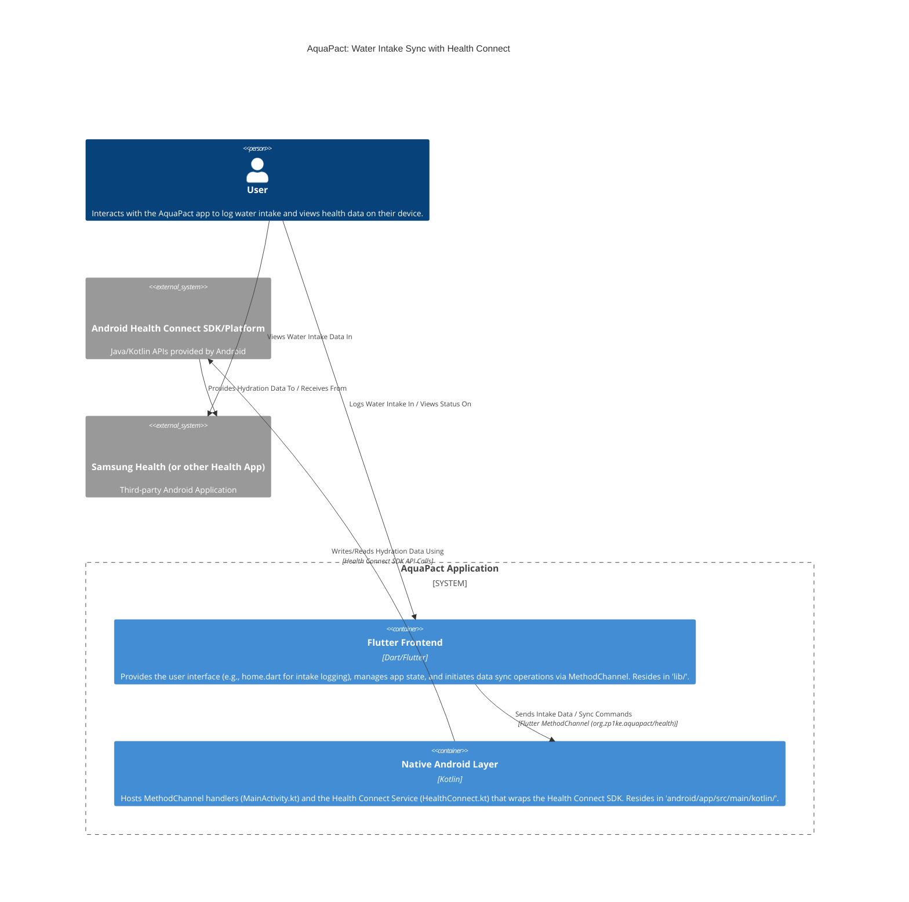

Diagram illustrating the high-level architecture of how the `aquapact` application synchronizes water intake records with the Android Health Connect platform, which can then be accessed by apps like Health Connect (currently implemented) and Samsung Health.

The home.dart file you're viewing is part of the "Flutter Frontend" container.

**Explanation of Components and Flow:**

1.  **User:** Interacts with the **Flutter Frontend** of the AquaPact app (e.g., using UI elements defined in home.dart) to log their water intake.
2.  **Flutter Frontend (lib):**
    *   Captures the intake data.
    *   Uses services like `IntakesHandler` (intakes.dart) and `HealthChannelService` (health.dart).
    *   Communicates with the **Native Android Layer** via a Flutter `MethodChannel`.
3.  **Native Android Layer (aquapact):**
    *   `MainActivity.kt`: Receives calls from the Flutter Frontend via the MethodChannel.
    *   `HealthConnect.kt`: Contains the logic to interact with the **Android Health Connect SDK**. It translates the app's intake data into `HydrationRecord` objects (or other relevant Health Connect data types) and uses the SDK to write them.
4.  **Android Health Connect SDK/Platform:**
    *   This is an on-device data store and API layer provided by Android.
    *   The AquaPact **Native Android Layer** uses this SDK to request permissions and then to insert, update, or delete water intake records.
5.  **Samsung Health (or other Health App):**
    *   Acts as a client to the **Android Health Connect Platform**.
    *   If the user has granted permissions, Samsung Health can read the hydration data written by AquaPact (and other apps) from Health Connect and display it within its own interface.
    *   The interaction between AquaPact and Samsung Health is indirect, mediated by the Health Connect platform.

This architecture allows AquaPact to contribute water intake data to a centralized health data store on the user's device, making it accessible to the user through various health and fitness applications they might use, like Health Connect and Samsung Health.
